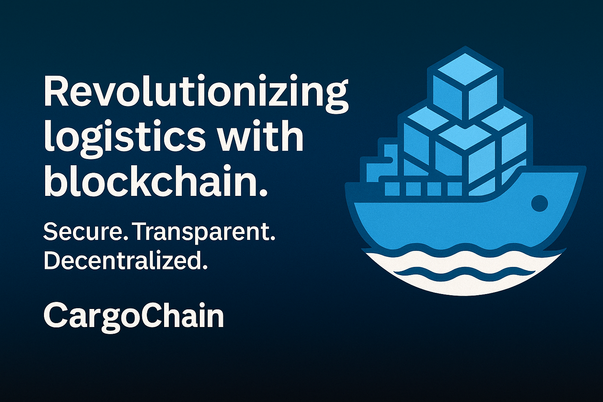

# LogiChain - Блокчейн-решение для логистики

## 🚀 Революция в управлении цепочками поставок

LogiChain - это инновационная блокчейн-платформа, созданная на базе Cosmos SDK, которая трансформирует логистические процессы вашей компании. Наше решение обеспечивает полную прозрачность, безопасность и эффективность в управлении грузоперевозками.

## 📋 Оглавление

- [Почему LogiChain?](#почему-logichain)
- [Ключевые возможности](#ключевые-возможности)
- [Быстрый старт](#быстрый-старт)
- [Установка](#установка)
- [Конфигурация](#конфигурация)
- [Использование](#использование)
- [API Документация](#api-документация)
- [Интеграция](#интеграция)
- [Поддержка](#поддержка)

## 🎯 Почему LogiChain?

### Проблемы традиционной логистики:
- ❌ Отсутствие прозрачности в цепочке поставок
- ❌ Высокие операционные издержки
- ❌ Мошенничество и поддельные товары
- ❌ Сложности в отслеживании грузов
- ❌ Долгие процедуры урегулирования споров

### Наше решение:
- ✅ **100% прозрачность** - каждое движение груза записывается в блокчейн
- ✅ **Снижение издержек до 30%** - автоматизация процессов
- ✅ **Защита от подделок** - неизменяемые записи о происхождении товаров
- ✅ **Мгновенное отслеживание** - real-time мониторинг
- ✅ **Смарт-контракты** - автоматическое исполнение договоров

## 🛠 Ключевые возможности

### 🔗 Отслеживание груза в реальном времени
- Мгновенное обновление статуса доставки
- GPS-интеграция для точного местоположения
- Уведомления о критических событиях

### 📄 Смарт-контракты для логистики
- Автоматические платежи при доставке
- Условные исполнения договоров
- Снижение времени на документооборот

### 🔒 Неизменяемые записи
- Полная история движения товаров
- Защита от фальсификации данных
- Доказательство подлинности товаров

### 🌐 Мультистороннее взаимодействие
- Интеграция с поставщиками, перевозчиками, получателями
- Единая экосистема для всех участников
- Стандартизированные протоколы обмена данными

### 📊 Аналитика и отчетность
- Детальная аналитика операций
- Прогнозирование сроков доставки
- Оптимизация маршрутов и издержек

## 🚀 Быстрый старт

### Системные требования
- Go 1.23+
- Docker 20.10+
- 4GB RAM минимум
- 50GB свободного места на диске

### Демо-запуск (5 минут)

```bash
# Клонирование репозитория
git clone https://github.com/yourcompany/logichain.git
cd logichain

# Запуск в Docker
docker-compose up -d
```

После запуска откройте браузер: `http://localhost:8080`

**Тестовые данные включены для демонстрации возможностей**

## 🔧 Установка

### Вариант 1: Docker (Рекомендуется)

```bash
# Загрузка образа
docker pull logichain/node:latest

# Запуск ноды
docker run -d --name logichain-node \
  -p 26657:26657 \
  -p 1317:1317 \
  -v logichain-data:/root/.logichain \
  logichain/node:latest
```

### Вариант 2: Компиляция из исходников

```bash
# Установка зависимостей
make install-deps

# Компиляция
make build

# Инициализация
./build/logichaind init mynode --chain-id logichain-1

# Запуск
./build/logichaind start
```

## ⚙️ Конфигурация

### Настройка для вашей компании

```yaml
# config/app.toml
company:
  name: "Ваша Логистическая Компания"
  id: "your-company-id"
  api_key: "your-secure-api-key"

network:
  chain_id: "logichain-production"
  rpc_port: 26657
  rest_port: 1317

integration:
  erp_system: "SAP/1C/Custom"
  payment_gateway: "enabled"
  notifications: "telegram/email/sms"
```

### Подключение к ERP-системам

```bash
# Генерация конфигурации интеграции
./logichaind config generate-integration --erp=SAP

# Тестирование подключения
./logichaind integration test --config=integration.yml
```

## 💼 Использование

### Создание нового груза

```bash
# CLI
logichaind tx logistics create-shipment \
  --from supplier \
  --to receiver \
  --goods "Electronics" \
  --value 10000 \
  --insurance true

# REST API
curl -X POST http://localhost:1317/logistics/shipments \
  -H "Content-Type: application/json" \
  -d '{
    "supplier": "supplier-address",
    "receiver": "receiver-address", 
    "goods": "Electronics",
    "value": 10000,
    "insurance": true
  }'
```

### Отслеживание груза

```bash
# Получение статуса
logichaind query logistics shipment [shipment-id]

# Полная история
logichaind query logistics history [shipment-id]
```

### Веб-интерфейс
- **Панель управления**: `http://localhost:8080/dashboard`
- **Отслеживание**: `http://localhost:8080/track`
- **Аналитика**: `http://localhost:8080/analytics`


## 💰 Экономическая модель

### Стоимость внедрения
- **Базовый пакет**: $0 (до 100 грузов/месяц)
- **Профессиональный**: $299/месяц (до 1000 грузов)
- **Корпоративный**: $999/месяц (безлимит)
- **Enterprise**: индивидуальные условия

### ROI для логистических компаний
- Снижение операционных издержек: **20-30%**
- Сокращение времени на документооборот: **60%**
- Уменьшение числа споров: **80%**
- Повышение клиентского доверия: **значительно**

## 🛡️ Безопасность

### Защита данных
- Шифрование AES-256 для всех данных
- Мультиподписи для критических операций
- Регулярные аудиты безопасности
- Соответствие GDPR и российскому законодательству

### Консенсус
- Алгоритм Tendermint BFT
- Устойчивость к 1/3 византийских узлов
- Финальность блоков за 6 секунд

## 📈 Производительность

### Характеристики сети
- **Пропускная способность**: 1000+ транзакций/секунду
- **Время блока**: 6 секунд
- **Время финальности**: мгновенно
- **Энергопотребление**: в 99.9% меньше чем Bitcoin

### Масштабируемость
- Горизонтальное масштабирование узлов
- Поддержка межсетевого взаимодействия (IBC)
- Возможность создания приватных сетей

## 🚀 Roadmap

### Q3 2025
- [ ] Интеграция с крупнейшими ERP системами
- [ ] Мобильное приложение для водителей
- [ ] AI-алгоритмы оптимизации маршрутов

### Q4 2025
- [ ] Поддержка IoT устройств
- [ ] Интеграция с международными таможенными системами
- [ ] Marketplace для логистических услуг

### 2026
- [ ] Поддержка NFT для уникальных товаров
- [ ] Кросс-чейн интеграции
- [ ] Decentralized Autonomous Organization (DAO) для управления

## 🏢 Кейсы использования

### Автомобильная промышленность
"Снизили время поиска комплектующих с 3 дней до 3 минут благодаря полной прозрачности цепочки поставок"
*- Крупный автопроизводитель*

### Фармацевтика
"100% гарантия подлинности лекарств от производителя до аптеки"
*- Фармацевтическая сеть*

### E-commerce
"Клиенты получают real-time обновления о доставке, жалобы сократились на 70%"
*- Интернет-магазин*

## 📄 Лицензия

MIT License - свободное использование для коммерческих целей.

**LogiChain** - будущее логистики уже здесь. Начните трансформацию вашего бизнеса сегодня!

*Разработано с ❤️ командой LogiChain*